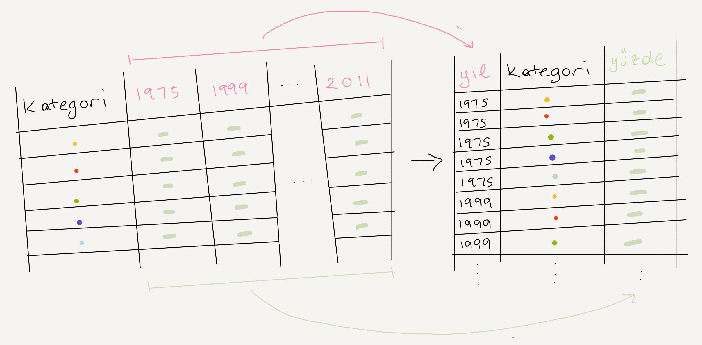

```{r child = "setup.Rmd"}
```

```{r paketleri-yukle, echo=FALSE, message=FALSE, warning=FALSE}
library(tidyverse)
library(scales)
```

## tidyverse

.pull-left[
- Tidyverse, veri bilimi için tasarlanmış R paketlerinin prensipli bir koleksiyonudur. 
- Tüm paketler, temel bir tasarım felsefesi, dilbilgisi ve veri yapısı paylaşır.
<br>
```{r img-tidyverse, echo=FALSE,out.width="50%", fig.align="center"}
knitr::include_graphics("img/tidyverse.png")
```
]
.pull-right[
```{r img-tidyverse-packages, echo=FALSE, out.width="100%"}
knitr::include_graphics("img/tidyverse-packages.png")
```
]

---

background-image: url(img/fishing-boat.png)
background-position: center
background-repeat: no-repeat
background-size: contain
class: inverse

# Dünya'da balıkçılık

---

- Birleşmiş Milletler'in Balıkçılık ve Su Ürünleri Bölümü ülkelerin balıkçılık üretimi hakkında veri toplar.
- Aşağıdaki (pek de çekici olmayan) görselleştirme 2016 yılındaki balıkçılık hasatının dağılımını göstermektedir.

<br>

.pull-left[
```{r img-wikipedia, echo=FALSE, out.width="100%", fig.align="center"}
knitr::include_graphics("img/fisheries-data.png")
```
]
.pull-right[
- Toplam hasadı 100.000 tondan az olan ülkeler görselleştirmeye dahil değil.
- Source: [Fishing industry by country](https://en.wikipedia.org/wiki/Fishing_industry_by_country)
]

---

.question[
Bu görselleştirmeyi nasıl geliştirirsiniz?
]

```{r img-balikcilik-orjinal-gorsel, echo=FALSE, out.width="60%", fig.align="center"}
knitr::include_graphics("img/fisheries.png")
```

--

- Kıtalara göre görselleştirme
- Haritalama

---

## Veri okuma

```{r veri-oku-balikcilik}
balikcilik <- read_csv("data/balikcilik.csv")
names(balikcilik)
```

---

## Verilere göz atalım

.midi[
```{r}
balikcilik
```
]

---

## Veri hazırlama

Toplam hasadı 100.000 tondan az olan ülkeleri filtreleyerek çıkaralım:

.midi[
```{r balikcilik-filtre}
balikcilik <- balikcilik %>%
  filter(toplam > 100000)

balikcilik
```
]

---

## Kıta verilerini okuyalım

.small[
```{r veri-oku-kitalar}
kitalar <- read_csv("data/kitalar.csv")
kitalar
```
]

---

class: middle

# Veri birleştirme

---

.pull-left[
```{r}
balikcilik %>% select(ulke)
```
]
.pull-right[
```{r}
kitalar
```
]

---

## Tabloları birleştirme

```{r eval=FALSE}
[*]_join(x, y)
```

- `inner_join()`: x ve y'deki ortak satırlar
- `left_join()`: x'teki bütün satırlar
- `right_join()`: y'deki bütün satırlar
- `full_join()`: x ve y'deki bütün satırlar
- `anti_join()`: x'te olan ve y'de olmayan bütün satırlar
- ...
 
---

## Set-up

Sonraki birkaç slayt için...

.pull-left[
```{r echo=FALSE}
x <- tibble(value = c(1, 2, 3))
```
```{r}
x
```
]
.pull-right[
```{r echo=FALSE}
y <- tibble(value = c(1, 2, 4))
```
```{r}
y
```
]

---

## `inner_join()`

.pull-left[
```{r}
inner_join(x, y)
```
]
.pull-right[
```{r echo=FALSE}
knitr::include_graphics("img/inner-join.gif")
```
]

---

## `left_join()`

.pull-left[
```{r}
left_join(x, y)
```
]
.pull-right[
```{r echo=FALSE}
knitr::include_graphics("img/left-join.gif")
```
]

---

## `right_join()`

.pull-left[
```{r}
right_join(x, y)
```
]
.pull-right[
```{r echo=FALSE}
knitr::include_graphics("img/right-join.gif")
```
]

---

## `full_join()`

.pull-left[
```{r}
full_join(x, y)
```
]
.pull-right[
```{r echo=FALSE}
knitr::include_graphics("img/full-join.gif")
```
]

---

## `anti_join()`

.pull-left[
```{r}
anti_join(x, y)
```
]
.pull-right[
```{r echo=FALSE}
knitr::include_graphics("img/anti-join.gif")
```
]

---

.question[
`balikcilik` tablosundaki tum satır ve sütunları tutmak ve bu tablodaki ülkelerin hangi kıtada olduğunu gosteren bir sütun daha eklemek istiyoruz. Hangi `*_join()` foksiyonunu kullanmalıyız?
]

.pull-left[
```{r}
balikcilik %>% select(ulke)
```
]
.pull-right[
```{r}
kitalar
```
]

---

## Balıkçılık ve kıtalar tablolarını birleştirme

```{r}
balikcilik <- left_join(balikcilik, kitalar) 
```

--

.question[
`left_join()` foksiyonu bu iki tabloyu `ulke` sütunu üzerinden birleştirmeyi nasıl biliyor?
]

İpucu:

- Orjinal `balikcilik` tablosundaki sütunlar:

```{r echo=FALSE}
balikcilik %>% select(-kita) %>% names()
```

- `kitalar` tablosundaki sütunlar:

```{r echo=FALSE}
names(kitalar)
```

---

## Verileri kontrol edelim

```{r}
balikcilik %>%
  filter(is.na(kita))
```

---

## Düzeltmeleri uygulayalım

```{r}
balikcilik <- balikcilik %>%
  mutate(kita = case_when(
    ulke == "Democratic Republic of the Congo" ~ "Africa",
    ulke == "Hong Kong"                        ~ "Asia",
    ulke == "Myanmar"                          ~ "Asia",
    TRUE                                       ~ kita
    )
  )
```

--

...ve tekrar kontrol edelim

```{r}
balikcilik %>%
  filter(is.na(kita))
```

---

.question[
Aşağıdaki kod ne yapar?
]

```{r}
balikcilik <- balikcilik %>%
  mutate(uretim_orani = uretim / toplam)
```

---

## Kıtalara göre özetleme

```{r message=FALSE}
balikcilik_ozet <- balikcilik %>%
  group_by(kita) %>%
  summarise(
    uretim_orani_min = min(uretim_orani),
    uretim_orani_ort = mean(uretim_orani),
    uretim_orani_max = max(uretim_orani)
  ) 

balikcilik_ozet
```

---

## Kıtalara göre görselleştirme

```{r fig.height=3, fig.width=7}
ggplot(balikcilik_ozet, aes(x = kita, y = uretim_orani_ort)) +
  geom_col()
```

---

## Görselleştirmeyi geliştirelim

```{r bar-chart-improve, fig.show = "hide"}
ggplot(balikcilik_ozet, 
       aes(y = fct_reorder(kita, uretim_orani_ort), #<<
           x = uretim_orani_ort)) +
  geom_col() +
  scale_x_continuous(labels = percent) + #<<
  labs( #<<
    x = NULL, y = NULL, #<<
    title = "Su ürünleri yetiştiriciliği oranı", #<<
    subtitle = "kıta ortalamaları, 2016", #<<
    caption = "Kaynak: bit.ly/2VrawTt" #<<
  ) + #<<
  theme_minimal() #<<
```

---

```{r ref.label = "bar-chart-improve", echo = FALSE, fig.height=4, fig.width=7}
```

---

## Veri çerçevesi oluşturma

.pull-left[
```{r}
kita_ceviri <- tribble(
  ~kita,      ~kita_turkce,
  "Asia",     "Asya",
  "Americas", "Amerika",
  "Europe",   "Avrupa",
  "Oceania",  "Okyanusya",
  "Africa",   "Afrika"
)
```
]
.pull-right[
```{r}
kita_ceviri
```
]

---

```{r bar-chart-improve-translate, fig.show = "hide"}
balikcilik_ozet %>%
  left_join(kita_ceviri) %>% #<<
  ggplot(aes(y = fct_reorder(kita_turkce, uretim_orani_ort),
             x = uretim_orani_ort)) +
  geom_col() +
  scale_x_continuous(
    labels = percent_format(prefix = "%", suffix = NULL) #<<
    ) + 
  labs(
    x = NULL, y = NULL,
    title = "Su ürünleri yetiştiriciliği oranı",
    subtitle = "kıta ortalamaları, 2016",
    caption = "Kaynak: bit.ly/2VrawTt"
  ) +
  theme_minimal()
```

---

```{r bar-chart-improve-translate, echo = FALSE, message = FALSE, fig.height=4, fig.width=7}
```

---

class: middle

# Mapping

---

## Balıkçılık verilerini haritalama

- Ülke sınırlarını veri çerçevesi olarak kaydet
- `balikcilik` veri çerçevesini ülke sinirlari veri çerçevesi ile birleştir
- Ülke sınırlarını çizip içlerini su ürünleri yetiştiriciliği oranıyla doldur


---

## `map_data()`

`map_data()` fonksiyonu **maps** paketindeki ülke sınırı verilerini ggplot2 ile görselleștirmesi kolay olacak bir veri çerçevesine çevirir:

```{r map-data-dunya}
map_data("world") %>% slice(1:15)
```

---

## Veri çerçeveleri: `data.frame` 

```{r map-data-dunya-df-code, eval=FALSE}
map_data("world")
```

```{r map-data-dunya-df-output, echo=FALSE}
map_data("world")[1:20,]
```

---

## Veri çerçeveleri: `tibble`

```{r map-data-dunya-tibble}
map_data("world") %>% as_tibble()
```

---

## Daha iyi eşleşme için birkaç düzeltme

.question[
Aşağıdaki kod ne yapar?
]

```{r dunya-haritasi-duzeltme}
dunya_haritasi <- map_data("world") %>%
  as_tibble() %>%
  mutate(region = case_when(
    region == "UK"           ~ "United Kingdom",
    region == "USA"          ~ "United States",
    subregion == "Hong Kong" ~ "Hong Kong",
    TRUE                     ~ region
    )
  )
```

---

## Dünya haritası

.midi[
```{r fig.height=3, fig.width=7}
ggplot(dunya_haritasi, aes(x = long, y = lat, group = group)) +
  geom_polygon(fill = "gray") +
  theme_minimal()
```
]

---

## Balıkçılık ve dunya haritası veri çerçevelerini birleştirelim

.pull-left[
```{r}
balikcilik %>% select(ulke)
```
]
.pull-right[
```{r}
dunya_haritasi %>% select(region)
```
]

---

```{r}
balikcilik_haritasi <- left_join(balikcilik, dunya_haritasi, 
                                 by = c("ulke" = "region"))
```

```{r}
glimpse(balikcilik_haritasi)
```

---

## Balıkçılık haritası

.midi[
```{r fig.height=3, fig.width=7}
ggplot(balikcilik_haritasi, mapping = aes(x = long, y = lat, group = group)) +
  geom_polygon(aes(fill = uretim_orani)) +
  scale_fill_viridis_c() +
  theme_minimal()
```
]

---

.question[
Aşağıdaki haritada yanıltıcı olan nedir?
]

.midi[
```{r echo=FALSE, fig.height=3, fig.width=7, fig.align="center"}
ggplot(balikcilik_haritasi, mapping = aes(x = long, y = lat, group = group)) +
  geom_polygon(aes(fill = uretim_orani)) +
  scale_fill_viridis_c() +
  theme_minimal()
```
]

---

## Parçaları bir araya getirelim

```{r uretim-yuzde-haritasi, fig.show = "hide"}
ggplot() +
  # 1. katman: bütün ülkelerin sınırları
  geom_polygon(dunya_haritasi, #<<
               mapping = aes(x = long, y = lat, group = group), 
               fill = "lightgray") +
  # 2. katman: balıkçılık verisi olan ülkelerin değerleri
  geom_polygon(balikcilik_haritasi, #<<
               mapping = aes(x = long, y = lat, group = group, 
                             fill = uretim_orani)) +
  scale_fill_viridis_c() +
  theme_minimal()
```

---

class: middle

```{r uretim-yuzde-haritasi, echo = FALSE, fig.height=3, fig.width=7}
```

---

## Görselleștirme geliștirme

```{r uretim-yuzde-haritasi-gelistir, fig.show = "hide"}
ggplot() +
  geom_polygon(dunya_haritasi,
               mapping = aes(x = long, y = lat, group = group), 
               fill = "lightgray") +
  geom_polygon(balikcilik_haritasi,
               mapping = aes(x = long, y = lat, group = group, 
                             fill = uretim_orani)) +
  scale_fill_viridis_c(
    labels = percent_format(suffix = NULL, prefix = "%") #<<
    ) +  
  theme_minimal() +
  theme(legend.position = "bottom") + #<<
  labs(
    x = NULL, y = NULL,
    fill = "Üretim oranı", #<<
    title = "Su ürünleri yetiştiriciliği oranı",
    subtitle = "Toplam balıkçılık değeri 100.000 tonun üzerindeki ülkeler, 2016",
    caption = "Kaynak: bit.ly/2VrawTt"
  )
```

---

```{r uretim-yuzde-haritasi-gelistir, echo = FALSE, fig.height=5, fig.width=7}
```

---

background-image: url(img/shubham-sharan-Z-fq3wBVfMU-unsplash.jpg)
background-position: center
background-repeat: no-repeat
background-size: contain
class: inverse

# Öğretim üyeleri

---

```{r echo=FALSE,out.width="80%",fig.align="center"}
knitr::include_graphics("img/staff-employment.png")
```

Kaynak: [American Association of University Professors (AAUP)](https://www.aaup.org/sites/default/files/files/AAUP_Report_InstrStaff-75-11_apr2013.pdf)

---

## Orjinal veri

- Satirlar: Öğretim üyesi kategorileri
- Sütunlar: Yıllar
- Değerler: Her yıl için bu kategorideki öğretim üyelerinin işe alınma oranı

```{r load-data-staff, message=FALSE}
ogretim_uyeleri <- read_csv("data/ogretim-uyeleri.csv")
ogretim_uyeleri
```

---

## İstediğimiz veri

- Satirlar: Yıl / Öğretim üyesi kategorileri kombinasyonu
- Sütunlar: Yıl, kategori, ve yüzde
- Değerler: Her yıl için bu kategorideki öğretim üyelerinin işe alınma oranı

```{r echo=FALSE, out.width="80%", fig.align="center"}

```


---

class: center, middle

```{r echo=FALSE,out.width="80%",fig.align="center"}
knitr::include_graphics("img/pivot.gif")
```

---

## `pivot_*()` fonksiyonlari

```{r echo=FALSE}
knitr::include_graphics("img/tidyr-longer-wider.gif")
```

---

## `pivot_longer()`

```{r eval=FALSE}
pivot_longer(data, cols, names_to = "isim", values_to = "deger")
```

1. `data`
2. `cols` (pivot edilecek sütunlar) - `kategori` dıșındaki bütün sütunlar
3. `names_to` (orjinal verideki sütun isimlerinin koyulacağı yeni sütunun ismi) - `yil`
4. `values_to`(orjinal verideki değerlerin koyulacağı yeni sütunun ismi) - `yuzde`

---

.midi[
```{r ogretim-pivot-longer}
ogretim_uyeleri_uzun <- ogretim_uyeleri %>%
  pivot_longer(cols = -kategori, 
               names_to = "yil", 
               values_to = "yuzde") %>%
  mutate(yuzde = as.numeric(yuzde))

ogretim_uyeleri_uzun
```
]

---

.question[
Bu görselleştirmeyi nasıl düzeltebiliriz?
]

.small[
```{r fig.height=3}
ogretim_uyeleri_uzun %>%
  ggplot(aes(x = yuzde, y = yil, 
             color = kategori)
         ) +
  geom_col(position = "dodge")
```
]

---

.midi[
```{r fig.height=3}
ogretim_uyeleri_uzun %>%
  ggplot(aes(x = yuzde, y = yil, 
             fill = kategori)  #<<
         ) +
  geom_col(position = "dodge")
```
]

---

.midi[
```{r fig.height=3}
ogretim_uyeleri_uzun %>%
  ggplot(aes(x = yuzde, y = yil, fill = kategori)) +
  geom_col()
```
]

---

.midi[
```{r fig.width=7, fig.height=3}
ogretim_uyeleri_uzun %>%
  ggplot(aes(x = yil, 
             y = yuzde, group = kategori, color = kategori)) +
  geom_line() +
  theme_minimal()
```
]

---

.midi[
```{r fig.width=7, fig.height=3}
ogretim_uyeleri_uzun %>%
  ggplot(aes(x = as.numeric(yil), #<<
             y = yuzde, group = kategori, color = kategori)) +
  geom_line() +
  theme_minimal()
```
]

---

.midi[
```{r ogretim-line-default, echo=FALSE, fig.width=7, fig.height=4}
ogretim_uyeleri_uzun %>%
  mutate(yari_zamanli = 
           if_else(kategori == "Yarı zamanlı öğretim görevlisi", #<<
                   "Yarı zamanlı öğretim görevlisi", "Diğer öğretim üyeleri")) %>% #<<
  ggplot(aes(x = as.numeric(yil), y = yuzde/100, group = kategori, 
             color = yari_zamanli)) + #<<
  geom_line() +
  theme_minimal()
```
]

---

.midi[
```{r ref.label = "ogretim-line-default", eval = FALSE}
```
]

---

.midi[
```{r ogretim-line-kirmizi, echo=FALSE, fig.width=7, fig.height=4}
ogretim_uyeleri_uzun %>%
  mutate(yari_zamanli = if_else(kategori == "Yarı zamanlı öğretim görevlisi", "Yarı zamanlı öğretim görevlisi", "Diğer öğretim üyeleri")) %>%
  ggplot(aes(x = as.numeric(yil), y = yuzde/100, group = kategori, 
             color = fct_rev(yari_zamanli))) + #<<
  geom_line() +
  scale_color_manual(values = c("red", "gray")) + #<<
  scale_y_continuous(
    labels = percent_format(accuracy = 1, prefix = "%", suffix = NULL) #<<
    ) +
  theme_minimal() +
  labs(title = "Öğretim üyelerinin ișe alınma trendleri", #<<
       x = "Yil", y = "Oran", color = NULL) + #<<
  theme(legend.position = "bottom") #<<
```
]

---

.midi[
```{r ref.label = "ogretim-line-kirmizi", eval = FALSE}
```
]

---

class: middle, center

background-image: url("img/greg-rakozy-oMpAz-DN-9I-unsplash.jpg")

<font color="white" style="bold" size="100px">Daha fazla bilgi için: tidyverse.org ve <br> rstudio.com/resources/cheatsheets <br> (Türkçe Çeviriler)!</font>

.footnote[
Photo by Greg Rakozy on Unsplash.
]
